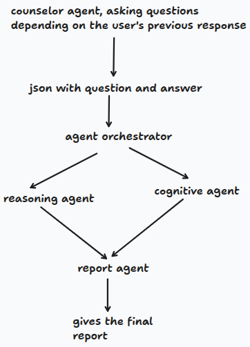

# Agentic Intelligence

## 1. Introduction

**Agentic Intelligence** is an autonomous multi-agent cognitive assessment system designed to evaluate a human user's logical reasoning and cognitive capabilities through dynamic interaction. Instead of relying on a monolithic prompt-response interaction or static evaluation forms, the system coordinates multiple specialist AI agents through a stateful graph and runnable pipelines:

1. **Questioner Agent (Counselor AI)**: Conducts an adaptive, multi-turn interview to probe the user's reasoning and cognitive limits.
2. **Agent Orchestrator**: Dynamically classifies and routes question-answer pairs to specialist evaluation domains using a compiled LangGraph state machine.
3. **Reasoning Analyst Agent**: Evaluates deductive logic, inductive reasoning, problem-solving heuristics, and premise validation.
4. **Cognitive Analyst Agent**: Evaluates pattern recognition, working memory retention & tracking, and attention to detail.
5. **Final Report Agent (Profile Analyst)**: Synthesizes multi-domain findings into a unified, professional cognitive intelligence profile.

---

## 2. Whole Workflow in Simple Steps

The end-to-end execution workflow operates through four straightforward stages connected by standardized JSON file bridges:

1. **Conduct Dynamic Interview**: The Counselor AI conducts a 5-turn calibrated dialogue with the user and saves the resulting question-and-answer pairs into `qa_transcript.json`.
2. **Partition & Route Tasks**: The Agent Orchestrator ingests the transcript, determines the cognitive domain of each question, and partitions tasks into `reasoning_agent` and `cognitive_agent` sets in `routed_tasks.json`.
3. **Parallel Specialist Analysis**: The Reasoning Agent and Cognitive Agent run concurrently to analyze their assigned tasks according to domain-specific rubrics, saving their evaluations to `agents_analysis.json`.
4. **Synthesize Final Report**: The Profile Analyst reconciles findings across all cognitive dimensions, identifies core strengths and blind spots, and generates a structured intelligence profile in `final_report.md`.

---

## 3. Detailed Architecture & Workflow



### Step 1: Questioner Agent (`agents/questioner/`)
- **Execution Flow**:
  - The Questioner conducts an orderly 5-turn cognitive interview managed by `run()` in `questioner_pipeline.py`.
  - **Turn 1 (Initial Question)**: Triggered when `count == 0`. Calls `generate_initial_question()` using a direct `PromptTemplate | LLM | PydanticOutputParser` chain to generate an opening question testing baseline logic or pattern recognition without prior conversation overhead.
  - **Turns 2 to 5 (Adaptive Follow-Ups)**: Triggered when `0 < count < 5`. Calls `generate_next_question()` using `ChatPromptTemplate` with `MessagesPlaceholder(variable_name="history")`. Dynamically injects the full conversation memory list (`AIMessage` and `HumanMessage` turns) to adapt follow-up questions to the user's prior responses.
- **Output Artifact**: Serializes all 5 question-answer pairs into `qa_transcript.json`.

### Step 2: Agent Orchestrator (`agents/agent_orchestrator/`)
- **Execution Flow**:
  - Ingests `qa_transcript.json` and executes a compiled **LangGraph** workflow (`START -> classify -> END`).
  - **Unified Classification Node (`_classify_node`)**:
    - Executes an LCEL chain (`PromptTemplate | LLM | PydanticOutputParser`) enforcing the `OrchestratorOutput` schema (`{reasoning_agent: dict, cognitive_agent: dict}`).
    - Autonomously delegates logic, deduction, and premise validation questions to `reasoning_agent`.
    - Autonomously delegates sequence reasoning, pattern recognition, and working memory questions to `cognitive_agent`.
    - Computes task distribution statistics (`total_tasks`, `reasoning_tasks_count`, `cognitive_tasks_count`).
- **Output Artifact**: Exports partitioned task assignments to `routed_tasks.json`.

### Step 3: Specialist Multi-Agent Analysis (`agents/reasoning_agent/` & `agents/cognitive_agent/`)
- **Reasoning Analyst Agent**:
  - Ingests the `reasoning_agent` task dictionary from `routed_tasks.json`.
  - Uses `ReasoningAnalysisOutput` with `PydanticOutputParser` enforcing `{qna: dict, reasoning_result: str}`.
  - Analyzes deductive reasoning, problem-solving heuristics, mathematical principles, and error patterns.
- **Cognitive Analyst Agent**:
  - Ingests the `cognitive_agent` task dictionary from `routed_tasks.json`.
  - Uses `CognitiveAnalysisOutput` with `PydanticOutputParser` enforcing `{qna: dict, cognitive_result: str}`.
  - Analyzes pattern recognition accuracy, working memory retention, and attention to operational details.
- **Execution & Persistence**:
  - Executed in parallel using LangChain's `RunnableParallel`.
  - Merged evaluations are saved to `agents_analysis.json`.

### Step 4: Final Report Agent (`agents/final_report/`)
- **Execution Flow**:
  - Ingests the combined specialist assessments from `agents_analysis.json`.
  - Executes an LCEL chain (`PromptTemplate | LLM | StrOutputParser`) to synthesize multi-domain findings into structured Markdown text.
  - Reconciles contrasting performance (e.g., strong cognitive pattern recognition vs. impaired deductive logic).
- **Report Structure**:
  1. **Executive Summary & Profile Persona**
  2. **Reasoning & Logical Capabilities** (Strengths, Deductive/Inductive logic, Error Patterns)
  3. **Cognitive & Attentional Capabilities** (Working memory, Pattern recognition, Attention to detail)
  4. **Synthesized Strengths & Blind Spots**
  5. **Overall Assessment & Development Recommendations**
- **Output Artifact**: Writes the final report to `final_report.md`.

### Step 5: End-to-End Orchestration (`agents/final_pipeline.py`)
- Connects the entire system into a single executable `RunnableSequence`:
  ```python
  workflow_chain = (
      RunnableLambda(step_interview_or_load)
      | RunnableLambda(step_orchestrate)
      | RunnableParallel({
          "reasoning_agent": RunnableLambda(step_reasoning),
          "cognitive_agent": RunnableLambda(step_cognitive),
      })
      | RunnableLambda(step_save_analysis)
      | RunnableLambda(step_report)
  )
  ```

---

## 4. Project File Structure

```text
agentic-intelligence/
├── agents/
│   ├── agent_orchestrator/
│   │   ├── ao_pipeline.py            # Single run() entry point for task orchestration
│   │   └── orchestrator.py           # LangGraph state machine & LLM task partitioner
│   ├── cognitive_agent/
│   │   ├── cognitive_agent.py        # Cognitive specialist evaluating pattern & memory
│   │   └── cognitive_pipeline.py     # Pipeline loading tasks & saving to agents_analysis.json
│   ├── final_report/
│   │   ├── report_agent.py           # Profile analyst synthesizing final report via StrOutputParser
│   │   └── report_pipeline.py       # Pipeline saving output to final_report.md
│   ├── questioner/
│   │   ├── models.py                 # Centralized HuggingFace LLaMA model factory
│   │   ├── questioner_agent.py       # 5-turn adaptive interview agent with message memory
│   │   └── questioner_pipeline.py    # Interactive CLI dialogue runner exporting qa_transcript.json
│   ├── reasoning_agent/
│   │   ├── reason_agent.py           # Reasoning specialist evaluating logic & deduction
│   │   └── reasoning_pipeline.py     # Pipeline loading tasks & saving to agents_analysis.json
│   └── final_pipeline.py             # Complete end-to-end RunnableSequence pipeline
├── assets/
│   └── workflow.png                  # Multi-agent architecture and workflow diagram
├── README.md                         # Project documentation and architectural overview
└── spec.md                           # Detailed system specification and component breakdown
```
